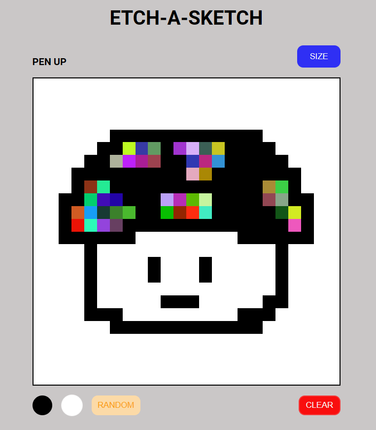

# Etch-a-Sketch

A browser based sketchpad inline with the [Project: Etch-a-Sketch](https://www.theodinproject.com/lessons/foundations-etch-a-sketch) of The Odin Project.  

Live preview [here](https://johnedisond.github.io/Etch-a-Sketch/).  

### Instructions

1. Click the SIZE button and a prompt will ask you to input a number between (2 - 100). This will determine the resolution of your sketchpad.  

2. See the word PEN UP?, press SPACEBAR on your keyboard and PEN UP will become PEN DOWN, this indicates that you can now draw or write something on the sketchpad. Press SPACEBAR again to deactivate the PEN.  

3. Click the BLACK button to have a black colored pen, WHITE button to ERASE, RANDOM button to have a rainbow like colored pen.  

        You can also press: 
        keyboard " 1 " for BLACK,
        keyboard " 2 " for ERASE,
        keyboard " 3 " for RANDOM.

4. Click CLEAR button to clear Sketchpad.  

** changing size while on the middle of sketching something will reset the sketchpad, removing all previous work.  

### Technologies
built with HTML, CSS, and Javascript.